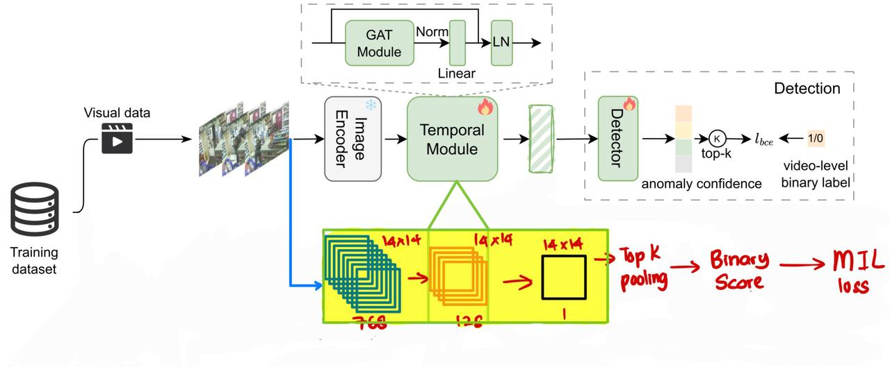

# VADL — Video Anomaly Detection & Localization

VADL is an AI-powered framework for detecting and localizing anomalies in video data.  
It leverages deep learning models to learn normal spatiotemporal patterns and identify deviations in unseen footage.

---

## 📁 Project Structure

```

VADL/
│
├── src/
│   ├── results/             # Contains image output and model weight output
│   │   ├── images/          # Contains image output of Evaluation and EDA
│   │   └── model_files/     # Contains the PyTorch model weight & the ONNX output
│   ├── preprocessing.py     # Data preprocessing (frame extraction, normalization, etc.)
│   ├── train.py             # Model training
│   ├── evaluate.py          # Model evaluation on validation/test sets
│   ├── convertonnx.py       # Converts trained model to ONNX format for deployment
│   ├── infer.py             # Run inference on video streams or files
│   ├── model.py             # Model architecture
│   ├── dataset.py           # Dataset loader utilities
│   ├── helper.py            # Helper functions and metrics
│   └── config.py            # Configuration builder
├── requirements.txt
└── README.md

````

---

## ⚙️ Setup

### Create Environment
```bash
python -m venv vadl-env
source vadl-env/bin/activate   # (Linux/Mac)
vadl-env\Scripts\activate      # (Windows)
````

### Install Dependencies

```bash
pip install -r requirements.txt
```

---

## Running the Project

Follow these steps **in order** to fully execute the VADL pipeline:

---

### Step 1 — Preprocessing

Extract frames, normalize, and prepare datasets.

```bash
python -m src.preprocessing
```

This script will:

* Extract frames from input videos.
* Sample one out of 16 frames.
* Sample until it reaches the end of video, or 256.

---

### Step 2 — Training

Train the anomaly detection model.

```bash
python -m src.train
```

This will:

* Load the preprocessed dataset.
* Initialize the model from `model.py`.
* Log metrics (accuracy, F1-score, loss) via Weights & Biases or local logs.
* Save the trained weights to `src/results/model_files/`.

---

### Step 3 — Evaluation

Evaluate the trained model on validation and test data.

```bash
python -m src.evaluate
```

Generates:

* Quantitative metrics (accuracy, F1, precision, recall).
* Visualization plots under `src/results/images/`.

---

### Step 4 — Convert to ONNX

Convert the PyTorch model to ONNX format for deployment or inference optimization.

```bash
python -m src.convertonnx
```

Output:

```
src/model_files/VADL_model_ONNX.onnx
```

---

### Step 5 — Inference

Run inference on new video files or camera streams.

```bash
python -m src.infer
```


Outputs:

* Frame-level anomaly scores.
* Bounding box visualization of detected anomalies.

---

# PLOVAD Localization & Optimization Report

We modified the original PLOVAD model by removing the multi-class classifier and adding a spatial feature map. The spatial feature map is then downsampled into 1 channel to be a heatmap. The model learns that high heatmap value is anomalous and low heatmap value is normal.


