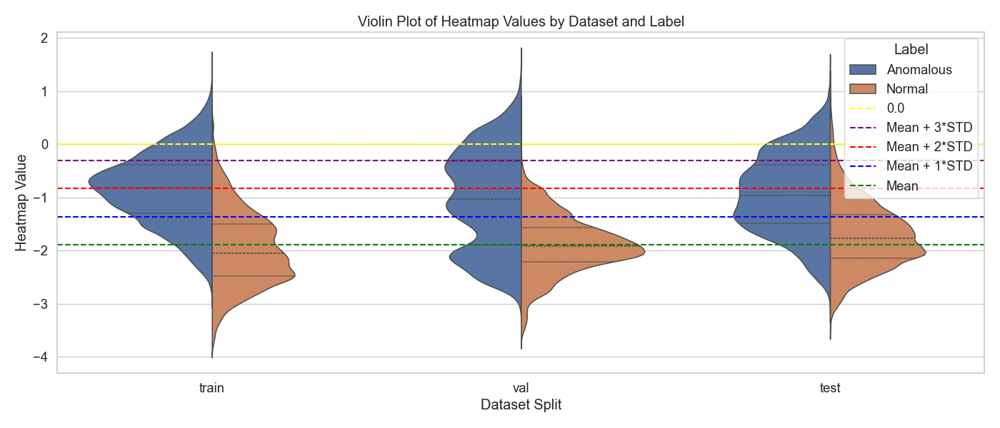

# MIMOS x AI — VADL Video Anomaly Detection & Localization

VADL is an AI-powered framework for detecting and localizing anomalies in video data.  
It leverages deep learning models to learn normal and abnormal spatiotemporal patterns and detect abnormal scen in unseen footage.

---

# Project 1 — Video Anomaly Detection

The goal of this project is to detect anomalies in videos.\
For this project, we used [PLOVAD: Prompting Vision-Language Models for Open Vocabulary Video Anomaly Detection](https://github.com/ctX-u/PLOVAD) to do anomaly detection and multi-class classification.\
Here are the attached result that we got from our initial testing.


---

# Project 2 — Video Anomaly Detection & Localization | Optimization

The goal of project 2 is to add **localization** feature to our previous project and then optimize it further to decrease inference time.\
For this project, we added a **localization head** to generate bounding box and then used **ONNX** to optimize and fuse computational graph to decrease the time taken.

## 📁 Project Structure

```

VADL/
│
├── src/
│   ├── results/             # Contains image output and model weight output
│   │   ├── images/          # Contains image output of Evaluation and EDA
│   │   └── model_files/     # Contains the PyTorch model weight & the ONNX output
│   ├── preprocessing.py     # Data preprocessing (frame extraction, normalization, etc.)
│   ├── train.py             # Model training
│   ├── evaluate.py          # Model evaluation on validation/test sets
│   ├── convertonnx.py       # Converts trained model to ONNX format for deployment
│   ├── infer.py             # Run inference on video streams or files
│   ├── model.py             # Model architecture
│   ├── dataset.py           # Dataset loader utilities
│   ├── helper.py            # Helper functions and metrics
│   └── config.py            # Configuration builder
├── requirements.txt
└── README.md

````

---

## ⚙️ Setup

### Create Environment
```bash
python -m venv vadl-env
source vadl-env/bin/activate   # (Linux/Mac)
vadl-env\Scripts\activate      # (Windows)
````

### Install Dependencies

```bash
pip install -r requirements.txt
```

---

## Running the Project

Follow these steps **in order** to fully execute the VADL pipeline:

---

### Step 1 — Preprocessing

Extract frames, normalize, and prepare datasets.

```bash
python -m src.preprocessing
```

This script will:

* Extract frames from input videos.
* Sample one out of 16 frames.
* Sample until it reaches the end of video, or 256.

---

### Step 2 — Training

Train the anomaly detection model.

```bash
python -m src.train
```

This will:

* Load the preprocessed dataset.
* Initialize the model from `model.py`.
* Log metrics (accuracy, F1-score, loss) via Weights & Biases or local logs.
* Save the trained weights to `src/results/model_files/`.

---

### Step 3 — Evaluation

Evaluate the trained model on validation and test data.

```bash
python -m src.evaluate
```

Generates:

* Quantitative metrics (accuracy, F1, precision, recall).
* Visualization plots under `src/results/images/`.

---

### Step 4 — Convert to ONNX

Convert the PyTorch model to ONNX format for deployment or inference optimization.

```bash
python -m src.convertonnx
```

Output:

```
src/model_files/VADL_model_ONNX.onnx
```

---

### Step 5 — Inference

Run inference on new video files or camera streams.

```bash
python -m src.infer
```


Outputs:

* Frame-level anomaly scores.
* Bounding box visualization of detected anomalies.

---

# PLOVAD Localization & Optimization Report

This repository contains the integration of localization in PLOVAD architecture and performance analysis. The objective was to include localization head (Output the bounding box wherever an anomaly is occuring), and minimize the inference time.
The model was inferenced on NVIDIA A4000 with 16GB VRAM.

We modified the original PLOVAD model by removing the multi-class classifier and adding a spatial feature map. The spatial feature map is then downsampled into 1 channel to be a heatmap. The model learns that high heatmap value is anomalous and low heatmap value is normal.


---
After further analyzing the heatmap values across all 3 data sets, and 2 labels, we have decided for using **μ + 3σ** as a threshold for the heatmap. If the heatmap value is below the threshold, it's considered normal, but if it's over the threshold, its considered anomalous.

Here are the plots to support the threshold hyperparameter setting. We are using the normal label from the validation dataset to get the threshold.




It is important to note that the exact value changes for each run, so it's recommended to calculate mean and standard deviation after every run and test it.

---
After including the localization head, our next goal is to proceed with exporting the PyTorch model to ONNX.

Here is the inference time taken for both PyTorch and ONNX model.


> Observation: We can see that no matter the frame number, the time taken is always around 1.5s to 1.8s for ONNX while for PyTorch it is around 2.5s to 3.0s.

---

We have constructed a custom loss so that both **detection head** and **localization head** learns if a video is anomalous or not.\
**Pros:** The model can learn where the anomaly occurs, so the model can localize the anomaly.\
**Cons:** Detecting anomalies is easier, so we have to stop learning when the model reaches the point where increasing detecting performance would worsen localization performance.

Here is the Confusion Matrix for the detection output of the model


